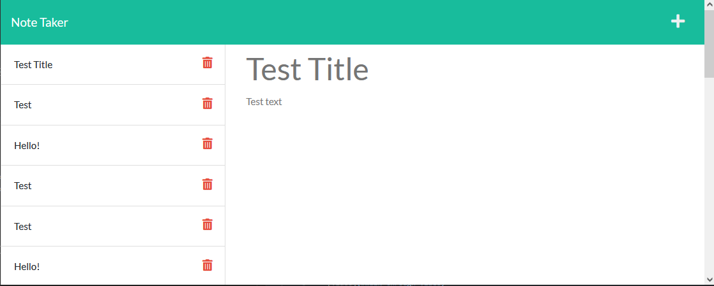

# Notetaker

This app will allow you to create new notes that will be saved!

## Table of Contents
* [Installation](#installation-and-usage)
* [Link](#link)
* [License](#license)
* [Tests](#tests)
* [Questions](#questions)

## Installation and Usage

No need to pull code! Simply click the heroku link. However, if you really feel like it, pull code and install NPM packages with `npm i --y` `npm i inquirer`.

## Link

https://git.heroku.com/stormy-sierra-55371.git

## License 

MIT

https://opensource.org/licenses/MIT

      Permission is hereby granted, free of charge, to any person obtaining a copy of this software and associated documentation files (the “Software”), to deal in the Software without restriction, including without limitation the rights to use, copy, modify, merge, publish, distribute, sublicense, and/or sell copies of the Software, and to permit persons to whom the Software is furnished to do so, subject to the following conditions:

      The above copyright notice and this permission notice shall be included in all copies or substantial portions of the Software.
      
      THE SOFTWARE IS PROVIDED “AS IS”, WITHOUT WARRANTY OF ANY KIND, EXPRESS OR IMPLIED, INCLUDING BUT NOT LIMITED TO THE WARRANTIES OF MERCHANTABILITY, FITNESS FOR A PARTICULAR PURPOSE AND NONINFRINGEMENT. IN NO EVENT SHALL THE AUTHORS OR COPYRIGHT HOLDERS BE LIABLE FOR ANY CLAIM, DAMAGES OR OTHER LIABILITY, WHETHER IN AN ACTION OF CONTRACT, TORT OR OTHERWISE, ARISING FROM, OUT OF OR IN CONNECTION WITH THE SOFTWARE OR THE USE OR OTHER DEALINGS IN THE SOFTWARE.

## Tests
 
 `npm run test` will run jest

## Questions

### GitHub Profile

https://github.com/magiksadie

### Email

sadiejo.h01@gmail.com